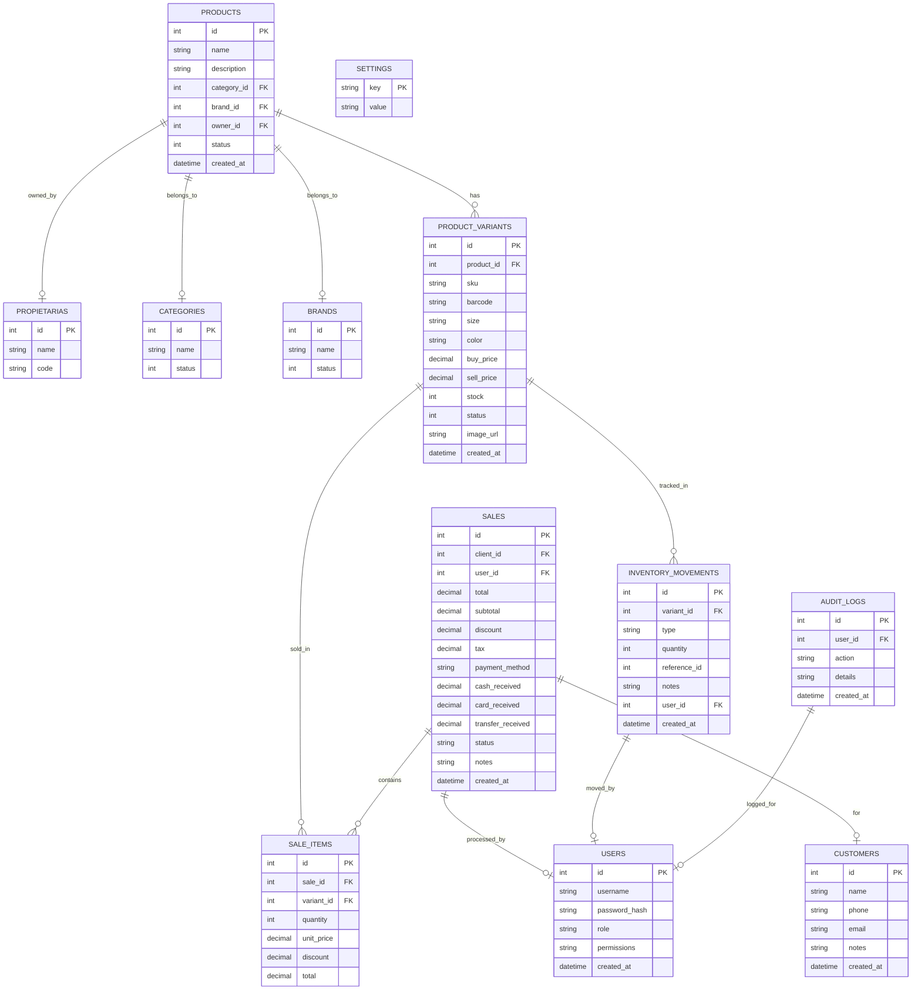

# Plan de Implementación - Sistema de Punto de Venta (POS) ANTARA

Este documento detalla la arquitectura, el diseño de la base de datos y la estrategia de implementación para el Punto de Venta (POS) y panel administrativo de la tienda de ropa **ANTARA**.

---

## User Review Required

> [!IMPORTANT]
> **Tecnología del Backend y Base de Datos**: 
> Se propone un backend en **Node.js (Express + TypeScript)** con una base de datos local **SQLite**. SQLite es ideal para esta instalación porque no requiere configurar un servidor de base de datos externo y mantiene toda la información en un solo archivo físico en la máquina local.
> 
> **Diseño y Estilos**:
> Cumpliendo con las directrices, se utilizará **Vanilla CSS** (sin TailwindCSS) para crear un diseño premium y responsive, inspirado en Shopify/Square, utilizando variables CSS (`--primary`, `--background`, etc.) para dar soporte a temas (claro/oscuro), animaciones sutiles y efectos modernos.
> 
> **Módulo de Etiquetas**:
> Las etiquetas mostrarán el código de barras (generado con `jsbarcode` en formato SVG para máxima nitidez al imprimir), SKU, talla, color, precio, propietaria (A/B) y el logo de ANTARA. Permitiremos seleccionar plantillas para impresoras térmicas (individuales) y hojas carta autoadhesivas (por ejemplo, cuadrículas de 3x10).

---

## Open Questions

> [!NOTE]
> 1. **Propietarias fijas**: ¿Las propietarias serán estrictamente "Propietaria A" y "Propietaria B" (por ejemplo, con nombres editables en configuración), o deberíamos implementar un catálogo dinámico de propietarias/socias para que puedan agregar más en el futuro?
> 2. **IVA**: ¿El precio de venta registrado ya incluye IVA, o se calcula al momento de cobrar según la configuración? (Por defecto propondremos que el IVA sea configurable, ej. 16% en México, y se pueda elegir si se calcula desglosado o incluido).

---

## Proposed Changes

La aplicación se dividirá en dos carpetas principales dentro de `C:\Users\juanb\PanelAntara`:
1. `backend/`: API REST en Express y SQLite.
2. `frontend/`: Aplicación React + TypeScript en Vite.

### Arquitectura de la Base de Datos (SQLite)

Diseñamos una base de datos normalizada con las siguientes relaciones:

---

### Backend

El backend se estructurará con una arquitectura limpia basada en Capas:
- **Models/Schema**: Definiciones de tablas y tipos.
- **Repositories**: Consultas SQL crudas parametrizadas con SQLite.
- **Controllers**: Lógica de negocio y manejo de peticiones Express.
- **Routes**: Definición de endpoints API.

#### [NEW] [package.json](file:///C:/Users/juanb/PanelAntara/backend/package.json)
Configuración de dependencias: `express`, `cors`, `sqlite3`, `sqlite`, `bcryptjs`, `jsonwebtoken` (para auth), y devDependencies para TypeScript.

#### [NEW] [tsconfig.json](file:///C:/Users/juanb/PanelAntara/backend/tsconfig.json)
Configuración de TypeScript para compilación Node.

#### [NEW] [src/database/connection.ts](file:///C:/Users/juanb/PanelAntara/backend/src/database/connection.ts)
Inicialización de la base de datos SQLite y definición de las migraciones (creación de tablas iniciales, inserción de usuario administrador semilla, marcas y categorías por defecto).

#### [NEW] [src/repositories/](file:///C:/Users/juanb/PanelAntara/backend/src/repositories/)
Módulos para interactuar con la base de datos de manera segura y limpia:
- `UserRepository.ts`
- `ProductRepository.ts`
- `CustomerRepository.ts`
- `InventoryRepository.ts`
- `SaleRepository.ts`
- `SettingsRepository.ts`

#### [NEW] [src/controllers/](file:///C:/Users/juanb/PanelAntara/backend/src/controllers/)
Controladores de API para desacoplar las rutas Express de la lógica de persistencia.

#### [NEW] [src/routes/](file:///C:/Users/juanb/PanelAntara/backend/src/routes/)
Configuración de las rutas REST expuestas al frontend.

#### [NEW] [src/index.ts](file:///C:/Users/juanb/PanelAntara/backend/src/index.ts)
Inicialización de Express, CORS, middlewares y escucha del puerto (por defecto `3001`).

---

### Frontend

El frontend será una Single Page Application (SPA) modular construida con React + TypeScript + Vite.

#### [NEW] [package.json](file:///C:/Users/juanb/PanelAntara/frontend/package.json)
Dependencias principales: `react`, `react-dom`, `lucide-react` (iconos), `canvas-confetti` (efecto de éxito visual al cobrar).

#### [NEW] [src/styles/index.css](file:///C:/Users/juanb/PanelAntara/frontend/src/styles/index.css)
Diseño global. Definición del sistema de diseño (variables HSL, fuentes premium, scrollbars elegantes, resets, botones elegantes, inputs minimalistas, sombras, modo oscuro y animaciones de transición).

#### [NEW] [src/context/AppContext.tsx](file:///C:/Users/juanb/PanelAntara/frontend/src/context/AppContext.tsx)
Contexto global para almacenar el usuario activo, configuraciones de la tienda, y el estado del carrito del Punto de Venta.

#### [NEW] [src/components/Layout/](file:///C:/Users/juanb/PanelAntara/frontend/src/components/Layout/)
Componentes estructurales como `Sidebar.tsx`, `Header.tsx` y layouts generales responsivos.

#### [NEW] [src/pages/](file:///C:/Users/juanb/PanelAntara/frontend/src/pages/)
Módulos de la aplicación:
- `Dashboard.tsx`: Indicadores clave, gráficas simuladas con SVG para ventas del día/mes, productos de bajo inventario, productos más vendidos.
- `POS.tsx`: Pantalla de venta interactiva. Buscador rápido por nombre/código, soporte de lector de código de barras (evento de teclado global), listado de carrito, selección de cliente, panel de cobro detallado con métodos mixto/efectivo/tarjeta, simulación de impresión de ticket.
- `Products.tsx`: Gestión de productos. Listado paginado con búsqueda y filtro por categoría/marca/estado. Formulario interactivo que permite añadir variantes fácilmente (con control de talla, color, precio de compra/venta e inventario individual).
- `Categories.tsx` & `Brands.tsx`: CRUDs sencillos y limpios en modales.
- `Inventory.tsx`: Registro de entradas, salidas y ajustes manuales. Historial completo con filtros de fecha y tipo de movimiento.
- `Customers.tsx`: Directorio de clientes con historial de compras de cada uno.
- `Users.tsx`: Administración de empleados y roles/permisos.
- `Sales.tsx`: Historial detallado de ventas con buscador y filtros. Permite ver el desglose del ticket, reimprimirlo o cancelar la venta (lo cual devuelve stock al inventario).
- `Labels.tsx`: Impresión de etiquetas. Permite elegir variantes por lote, configurar dimensiones de etiquetas (térmica o plantilla de carta), ver una previsualización interactiva con código de barras legible e imprimir mediante la API del navegador (`window.print()`).
- `Settings.tsx`: Modificar nombre de la tienda, dirección, teléfono, IVA, y logo.

#### [NEW] [src/services/api.ts](file:///C:/Users/juanb/PanelAntara/frontend/src/services/api.ts)
Cliente HTTP simplificado para conectarse al backend y manejar el tipado de TypeScript en las respuestas de la API.

---

### Root Configuration (Orquestación de Desarrollo)

Para facilitar la ejecución, crearemos un `package.json` en la raíz del proyecto para levantar ambos servidores (backend y frontend) en paralelo.

#### [NEW] [package.json](file:///C:/Users/juanb/PanelAntara/package.json)
Configuración de scripts npm raíz utilizando `concurrently` o ejecutando comandos en paralelo para simplificar la vida del usuario.

---

## Verification Plan

### Automated Tests
Para validar la corrección de la API y de los componentes, implementaremos pruebas de integración rápidas en el backend para validar:
- Creación de producto y variantes.
- Procesamiento de venta con actualización automática de stock.
- Reversión de stock al cancelar una venta.

### Manual Verification
1. **Inicio de sesión**: Ingresar con credenciales por defecto (`admin` / `admin123`).
2. **Crear variantes**: Dar de alta un producto "Playera Oversize" con variantes de tallas/colores y verificar que en la base de datos se creen las variantes asociadas.
3. **Flujo de POS**: Agregar artículos, aplicar descuento, seleccionar método de pago mixto, cobrar y simular ticket.
4. **Validación de Inventario**: Verificar que el stock de cada variante haya decrementado.
5. **Cancelación de Venta**: Cancelar la venta anterior y comprobar que el stock regrese a su valor original.
6. **Impresión de Etiquetas**: Ir al módulo de etiquetas, agregar un lote de variantes, previsualizar la hoja carta/térmica y mandar a imprimir para validar la maquetación CSS.
